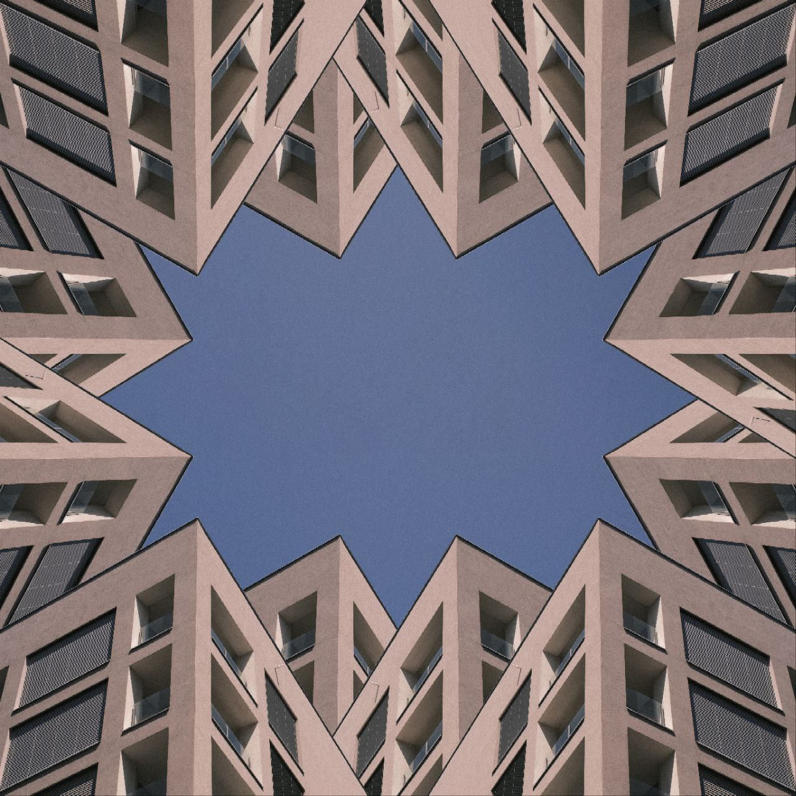
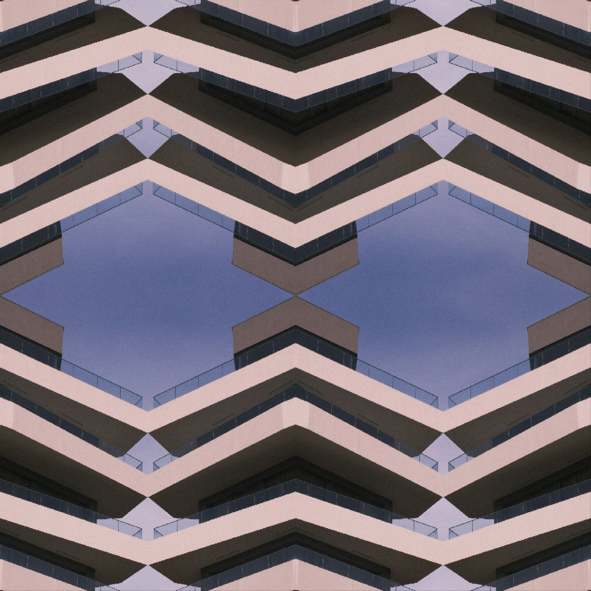
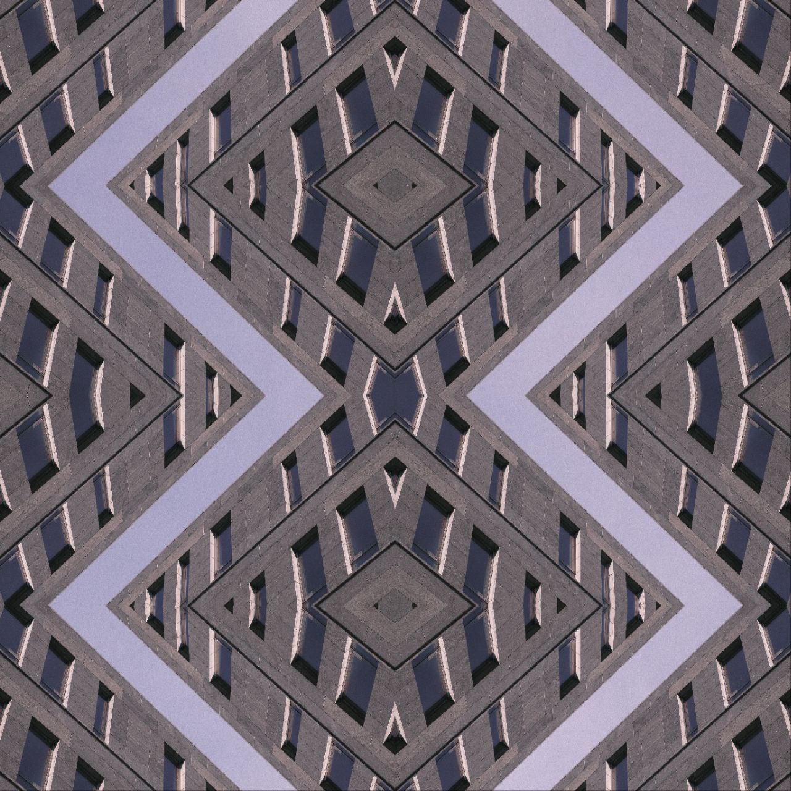

- [**Ivan Raudin**](./index.md) <!-- Use `index.md` as well. `./` is a shortcut back to your home page `index.md` -->
    - [Work](work.md)
    - [Writing](writing.md)
    - [About](about.md)
## MY WORK

## **People**
[I dont really into shooting people. As I write erlier, I prefer architekture, lines, stability etc. But for sure making photos of people could be fun even for me. Here you can see some examples.]
[My best friend Soltan. Made in studio]

[Some street photos]

[**Landscape**]
[I am a traveller, so I have some landscape photos as well :)
This is my pictures from trip to Austrian alps]

BW nude 
[One of my latest projects. Again, as I said about photos of people - dont really like it. But I think that I made this photos in a way its not about human, its not about sex or natural beauty(usually photos of people are about this topics), but about minimalism, lines, abstraction. Its like feelings when you wake up after weird dream.]

[**ARCHITEKTURE**]
[My lovely architecture. I cant stop making photos of amazing buildings, of beautiful fassades or stuning urbanistics around us. This photos are also from my trips around the Europe. Collecting europinian brutal lines that staying here for ages or for few last years - my life goal.]

[**ORNAMENTS**]
[My last big project for uni. I wanted to move architecture photography a little bit further. I've seen a lot of same pictures in instagram - abstract building from each side of a picture, usually an airplane in a midlle. But I wanted to make it different. There is no deep thoughts. Just absctract lines that make me feel something.]

[**Studio**]
[Here is some studio photos!]

